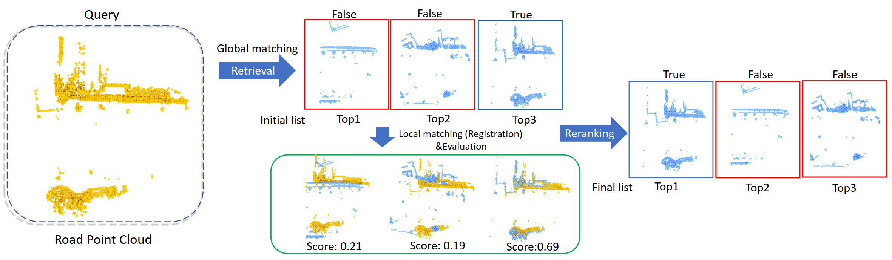

# Rank-PointRetrieval: Reranking Point Cloud Retrieval via a Visually Consistent Registration Evaluation
Codes for Rank-PointRetrieval: Reranking Point Cloud Retrieval via a Visually Consistent Registration Evaluation. IEEE Transactions on Visualization and Computer Graphics (TVCG), 2022. See [IEEE PDF](https://ieeexplore.ieee.org/stamp/stamp.jsp?tp=&arnumber=9764639).



Re-ranking is a critical step in improving retrieval accuracy, yet little effort has been devoted to re-ranking in point cloud
retrieval. In this paper, we investigate the versatility of rigid registration in re-ranking the point cloud retrieval results. Specifically, after getting the initial retrieval list based on the global point cloud feature distance, we perform registration between the query and point clouds in the retrieval list. We propose an efficient strategy based on visual consistency to evaluate each registration with a registration score in an unsupervised manner. The final re-ranked list is computed by considering both the original global feature distance and the registration score.


## 1) Pre-requisites

- Python 3
- open3d-python
- Sklearn
- Pytorch
- CUDA
- Scipy

## 2) Prepare Data

### 2.1 > Downloading dataset

Download the zip files of the benchmark datasets [here](https://drive.google.com/open?id=1Wn1Lvvk0oAkwOUwR0R6apbrekdXAUg7D) which is provided by PointNetVLAD project. Extract the folder in the directory. Thus, you must have a benchmark_datasets/ folder in the root folder.

### 2.2 > Generating index queries

To make things similar to others, we also use queries files to index each dataset. The files only need to be generated once.
```
cd generating_queries/

# Datas for evaluation
python generate_test_sets.py
```

>For advanced users to prepare dataset queries for training: (same as PointNetVLAD)

```
# For training tuples in baseline network
python generate_training_tuples_baseline.py

# For training tuples in refined network
python generate_training_tuples_refine.py
```

### 2.3 > Pre-built model vectors

To simplify testing steps for the paper, we provide pre-built model vectors under the MODEL_VECTORS/, which are the features distances for the testing set from the corresponding models, such as Minkloc3D. 

> For advanced users to generate your own vectors files:

please refer to [5)](#5-Generating-your-own-vectors).

### 2.4 > Check your files

Now, you'll have a folder structure like this:
```
[root]
  |-- benchmark_datasets
  |   |-- inhouse_datasets
  |   |   |-- business_run1
         ...
  |   |-- oxford
  |   |   |-- 2014-05-19-13-20-57
         ...
  |-- generating_queries
  |   |-- business_evaluation_database.pickle
  |   |-- business_evaluation_query.pickle
     ...
  |-- MODEL_VECTORS
  |   |-- pcan
  |   |   |-- business_dataset_vectors.pickle
  |   |   |-- business_query_vectors.pickle
         ...
  |   |-- lpd
     ...
  |-- MODEL_FILES
  |-- reg
  |-- README.md
  ...
```

## 3) Evaluation

To evaluate the registration, run the following command:
```
cd reg
python evaluate_model.py \
    --dataset_prefix ${dataset_name} \
    --model ${model's name} \
    --with_reg \
    --reg ${reg's type} \
    --keypoints ${number of keypoints} \
    --keytype ${the type of selecting keypoints} \
    --lamda1 ${weight for the model's feature distance} \
    --lamda2 ${weight for the registration's evaluation score}
```

For example:
```
# Run the code with PCAN model's feature vector on business dataset,
#   DO NOT use registration (the result will be the same as PCAN's raw result)
python evaluate_model.py --model pcan --dataset_prefix business

#   use Reg_VC to evaluate registration
python evaluate_model.py --model pcan --dataset_prefix business --with_reg --reg 'vc'

#   with ploss but NO registration
python evaluate_model.py --model pcan-ploss --dataset_prefix business

#   with ploss and use Reg_VC to evaluate registration
python evaluate_model.py --model pcan-ploss --dataset_prefix business --with_reg --reg 'vc'
```

As the filename of log files which saves results will defer by args automatically, you could run all 4 commands at the same time.

Another example:
```
# Run the code with LPD model's feature vector on university dataset,
#   use Reg_VC with all points to evaluate registration
python evaluate_model.py --model lpd --dataset_prefix university --with_reg --reg 'vc'

#   use Reg_OR with all points to evaluate registration
python evaluate_model.py --model lpd --dataset_prefix university --with_reg --reg 'or'
```

Here is each arg's instruction with more details:
```
--dataset_prefix : ${dataset_name} must be one of
        'business', 'university', 'residential' or 'oxford'.
        The name is the prefix of pickle files under generating_queries/ .

--model : ${model's name} must be one of
        'pointnetvlad', 'pointnetvlad-ploss', 'pcan', 'pcan-ploss', 'lpd'.
        The name is the same as the folder's name under MODEL_VECTORS/ .

--with_reg : if no such arg, the registration won't be used,
             and the result is the same as the model's result.

--reg : ${reg's type} must be one of 'or', 'vc'.
       'or' is to use Overlap Ratio,
       and 'vc' to use Visual Consistency to evaluate the registration.

--keypoints : ${number of keypoints} is the keypoints number to use when registration.
        If set to 0, all points will be used.

--keytype : ${the type of selecting keypoints} is the type using for selecting keypoints.
        Usually 'rand' is enough for evaluating.
```

## 4) Training

You can refer to the `train.py` to train PointNetVLAD or PCAN which is provided in `/models` folder.

Run the command for more details:
```
python train.py --help
```

The default loss is Ploss in `train.py`. You can choose other losses in `/loss/pointnetvlad_loss.py` to perform the training process.

## 5) Generating your own vectors

The vectors in [2.3]() are generated by `reg/get_model_vectors.py` or `reg/get_model_vectors_tf.py`.

### 5.1 > For Pytorch models

For PCAN+Ploss and PointNetVLAD+Ploss, we use our trained pytorch pth models.
Our models can be downloaded [here](https://drive.google.com/drive/folders/1kGJRrlr0e4a5dCSLaQRHb1qR8Qzpnfm7?usp=sharing).

After put the model's pth files under `[root]/MODEL_FILES/`, for example pcan.pth, make sure the settings in `get_model_vectors.py` are correct.

- The model's loading in evaluate() and get_latent_vectors(), usually they are the same as original evaluate.py in offical projects.

- The model's pth file's position in `MODEL_FILE`.

- The model's name in `MODEL_NAME`, which will be used in `--model ${your model name}` when evaluating.

Then, you could run the command to output vectors:
```
cd reg

python get_model_vectors.py --dataset_prefix #{your dataset name}
```

The vectors will be saved under `VECTOR_FOLDER`, which is `[root]/MODEL_VECTORS/{your model name}/{your dataset name}_evaluation_database.pickle` and `{your dataset name}_evaluation_query.pickle` when default.

Thus, you could use command to check this model's result:
```
python evaluate_model.py --model ${your model name} --dataset_prefix #{your dataset name} --with_reg --reg 'or'
```

### 5.2 > For TensorFlow models

For the orign PointNetVLAD, PCAN and LPD-Net, we use the tensorflow models provided in each offical project.

To generate the vectors using the tensorflow model, you need to copy `get_model_vectors_tf.py` and `config_reg.py` to each offical project to exacute.

As there may be something different with your case, check if `get_model_vectors_tf.py` could find the model's file, edit it refer to `evaluate.py` in offical project if necessary.

Make sure the constants are correct. Which model file to use in `MODEL_FILE`, what's the model's name `MODEL_NAME`,

Run the comand to generate vectors:
```
python get_model_vectors_tf.py --dataset_prefix ${dataset_prefix}
```

Remember the dataset's queries pickle files must exist in the `[offical_project_root]/generating_queries/` .

### 5.2 > For more cases

It's really awful to combine such complex files to an existing model for a small work of saving vectors.

The key is to save `DATABASE_VECTORS` and `QUERY_VECTORS` to files with corresponding dataset's prefix name.

So you can edit your `evaluate.py` to output vectors, like what is done in  `evaluate_model()` of `get_model_vectors.py`.

Then, put vectors under `MODEL_VECTORS/your_model_name/` .

Thus, you could use `--model your_model_name` to use your model's feature distance results to try the registration.
